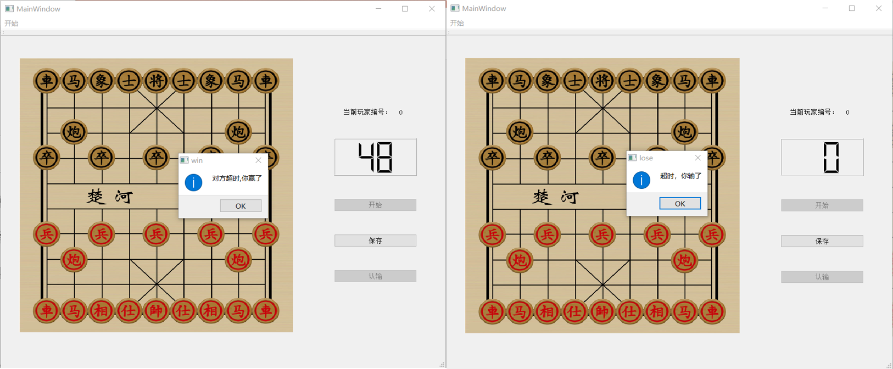

# 网络象棋对战-说明文档

## 1、功能说明

### 1.1 初始界面

​	初始界面中包含一个菜单栏，菜单栏中有一个建立连接选项，可以用来与其他程序建立连接。


### 1.2 建立连接

​	单击建立连接后，会弹出一个对话框以配置连接的相关信息，包括创建服务器/客户端，ip地址（服务器显示其ip地址，客户端可输入所需连接的ip），端口号。


### 1.3 等待连接

​	等待连接时，显示其ip地址与端口号。


### 1.4 游戏初始界面

​	连接建立后，会跳转到游戏的初始界面，包括一个菜单栏，一个label显示当前玩家编号，一个倒计时器，以及开始、保存、认输的按钮，在游戏未开始的时候，认输按钮被禁用。


### 1.5 游戏导入

​	菜单栏的开始选项中有导入按钮，按下后可选择本地残局进行导入。


### 1.6 游戏开始


​	游戏开始后，开始按钮被禁用，正在下棋的玩家的计时器启动。

### 1.7 游戏胜负判定

​	若成功吃掉对方的将/帅，则游戏胜利。


​	若点击认输，则游戏失利。


​	若在规定时间内没有下棋， 则游戏失利。



## 2、 设计思路

​	网络象棋对战主要可拆分为象棋游戏和网络对战两个板块。

### 2.1 象棋游戏的实现

	象棋游戏实现在类`gameControler`中, 这个类实现了棋局的控制、棋局的绘制以及棋局信息的传递，其主要对外接口如下。

```cpp
class GameControler : public QWidget
{
    Q_OBJECT
public:
    explicit GameControler(QWidget *parent = nullptr);
    void loadGame();
    enum Type
    {
        marshal = 0,
        guardian = 1,
        elephant = 3,
        horse = 5,
        car = 7,
        cannon = 9,
        soldier = 11,
        all = 16
    };
    int getCurPlayer() const;
    QString getGame() const;
    void setMove(QString st);
    void setGame(const QString &st = "");
    void setStart();
    void setEnd();
    void setPlayerID(int id);
signals:
    void move(QString st);
    void win();
    void lose();
    void jiangjun();
    void beijiang();
    void timeout();
};

```

#### 2.2.1 编号

	红方为0号玩家，黑方为1号玩家，每方的16枚棋子的编号如下：

-----------------------

| 棋子种类 |      编号      |
| :------: | :------------: |
|  将/帅   |       0        |
|    士    |      1,2       |
|    象    |      3,4       |
|    马    |      5,6       |
|    车    |      7,8       |
|    炮    |      9,10      |
|  卒/兵   | 11,12,13,14,15 |

​	枚举类`Type`中每个棋子类型的枚举值为这种棋子的最小编号，`all`的枚举值是总的棋子个数。

#### 2.2.2 对外接口

​	用户可通过以"set"为前缀的成员函数对棋局进行控制，包括设定残局`setGame`、玩家编号`setPlayerID`、开始游戏`setStart`、走子方式`setMove`、结束游戏`setEnd`。

​	用户可通过以"get"为前缀的成员函数获得棋局的基本信息，包括正在行动的玩家的编号`getCurPlayer`，现在的棋局`getGame`。

​	当局面发生改变的时候，该类会发射响应的信号，包括棋子移动`move`(`st`中存储了棋子的具体移动方式),获胜`win`，失利`lose`,将军`jiangjun`，被将军`beijiang`，超时`timeout`。

​	同时，该类还存储了主界面中的一个`QLCDNumber`的指针，用以显示剩余时间。

#### 2.2.3 棋局的储存与传递

​	在类的内部，棋局存储在一个二维数组`QPoint p[2][16]`中，`p[i][j]`表示i号玩家的j号棋子的位置，若被吃掉储存为(-1,-1)。

​	在`setGame`和`getGame`中，棋局用与样例文件相同的格式保存。得到这种形式的棋局后，使用正则表达式对其进行解析。

#### 2.2.4 棋局的绘制

​	使用QPainter的2D绘图绘制棋局，棋盘背景、棋子为添加到资源文件中的已有图片。

#### 2.2.5 棋局控制

​	棋局控制的主要内容是判断合法性，合法性判定被封装在一个成员函数`bool check(int per, int id, int x, int y)`中，表示判断per号玩家的id号棋子能否移动到位置(x,y)。

​	红棋和黑棋的移动规则在本质上是一样的，因此如果检验的是黑棋的移动，该函数首先会对所有棋子做一次对称，然后执行与红棋相同的代码，最后再对称回去。

​	另外，还利用`QTimer`进行超时的判定，每一秒使`QLCDNumber`的值减一，当减到0时即为超时。

### 2.2 网络对战的实现

​	`MainWindow`类中存储一个`GameControler`类的对象，用以存储棋局信息。对于`GameControler`中的信号`move`,`lose`,`jiangjun`,`beijiang`,`timeout`，`MainWindow`都有相应的槽函数。另外，`MainWindow`类还利用`QTcpServer`与`QTcpSocket`实现了网络对战。

#### 2.2.1 服务器的初始化

​	服务器的初始化主要包括`void initServer();`和`void acceptConnection();`两个函数，分别表示启动服务器和接受客户端连接。

#### 2.2.2 客户端的初始化

​	客户端的初始化主要包括`void connectHost();`与`void setConnect();`两个函数，分别表示连接到服务器及连接成功后的响应。

#### 2.2.3 通信协议

​	两个程序间需要互传游戏导入，游戏开始，认输，超时，下子的信息，其传输协议如下：

-----------------

|   动作   |       语法        |                 备注                 |
| :------: | :---------------: | :----------------------------------: |
| 游戏导入 | load [导入的文件] |     文件需严格按照样例文件的格式     |
| 游戏开始 |       start       |                                      |
|   认输   |      givein       |                                      |
|   超时   |      timeout      |                                      |
|   下子   |  move_per_id_x_y  | per号玩家的id号棋子被移动到了点(x,y) |

